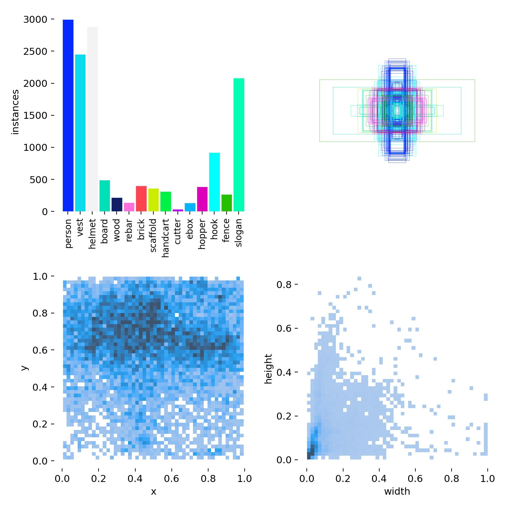
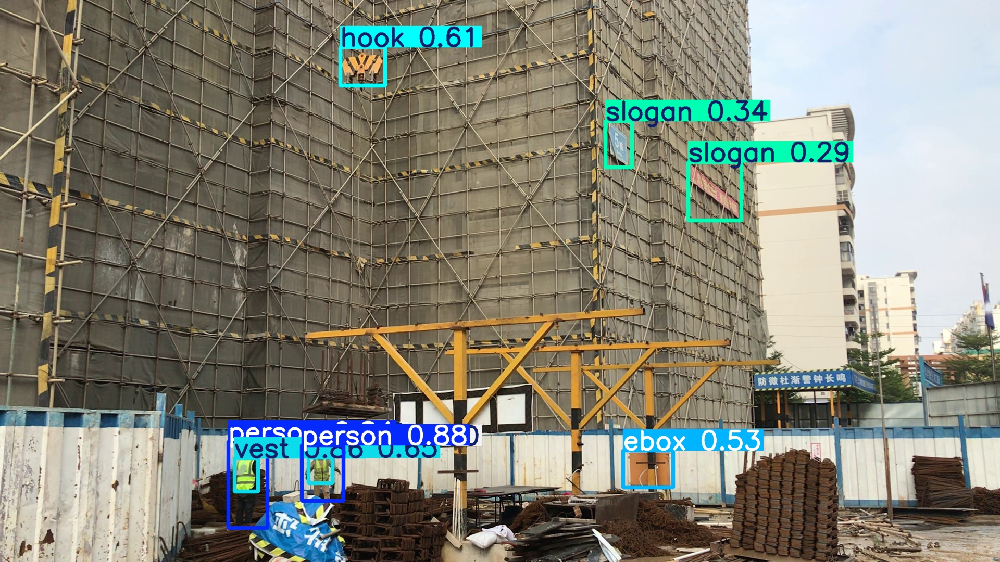
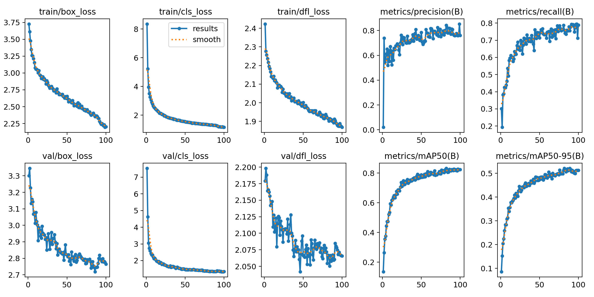

# Object Detection using YOLOv10 and RT-DeTr in AWS Sagemaker

## Overview

This project implements object detection in construction sites using the latest versions of the **YOLOv10** and **RT-DeTr** architectures, leveraging `PyTorch` and the `Ultralytics` libraries. The models were trained on AWS SageMaker, utilizing a `ml.g4dn.xlarge` instance. This instance includes 1 NVIDIA T4 Tensor Core GPU with 16 GB GPU memory. The instance was configured with a 50 GB EBS volume to handle the dataset's size.

The dataset used in this project is a curated subset of the *SODA: A large-scale open site object detection dataset for deep learning in construction*, by Rui Duan, Hui Deng, Mao Tian, Yichuan Deng, and Jiarui Lin. The original dataset can be found [here](https://www.sciencedirect.com/science/article/abs/pii/S0926580522003727).

## Dataset

This curated, "bite-sized" dataset contains:

- **Training set**: 1000 images with labels.
- **Testing set**: 100 images with labels.

The subset has the following distribution of labeled objects, bounding boxes dimensions and center coordinates:

The images are in `.jpg` format, and the labels have been transformed to `.txt` files, following the format expected by the YOLOv10 and RT-DeTr models. The original `.xml` label files are also included.

### Label Format

The label files follow this format:

| label | x-coord | y-coord | width | height |
|-------|---------|---------|-------|--------|
|   1   | 0.3229  | 0.8477  | 0.0333 | 0.1157 |

- **label**: The class label of the object (numeric).
- **x-coord**: Normalized x-coordinate of the bounding box.
- **y-coord**: Normalized y-coordinate of the bounding box.
- **width**: Normalized width of the bounding box.
- **height**: Normalized height of the bounding box.

## Results

The performance of YOLOv10 and RT-DeTr was evaluated using various metrics, with the results summarized below:

| Metric        | YOLOv10-n | RT-DeTr-l |
|---------------|-----------|-----------|
| **mAP50**     | 0.82427   | 0.9073    |
| **mAP50-95**  | 0.51262   | 0.5854    |
| **Precision** | 0.76006   | 0.86107   |
| **Recall**    | 0.78887   | 0.89708   |
| **Training Time** | 0.569 hours | 1.924 hours |
| **Inference Speed** | 2.3ms per image | 15.1ms per image |

 

## Results

The performance of YOLOv10 and RT-DeTr was evaluated using various metrics, with the results summarized below:

| Metric        | YOLOv10-n | RT-DeTr-l |
|---------------|-----------|-----------|
| **mAP50**     | 0.82427   | 0.9073    |
| **mAP50-95**  | 0.51262   | 0.5854    |
| **Precision** | 0.76006   | 0.86107   |
| **Recall**    | 0.78887   | 0.89708   |
| **Training Time** | 0.569 hours | 1.924 hours |
| **Inference Speed** | 2.3ms per image | 15.1ms per image |

  
To demonstrate that the models are capable of object detection, I present the following object detection examples

**YOLOv10**

**DeTr**

## **YOLOv10**
The best results for this model were achieved with the pretrained version `yolov10n.pt`:

 

The **normalized confusion matrix** for YOLOv10:

 

## **DeTr**
The best results for the DeTr were achieved with the pretrained version `rtdetr-l.pt`:

 

The **normalized confusion matrix** for RT-DeTr:

